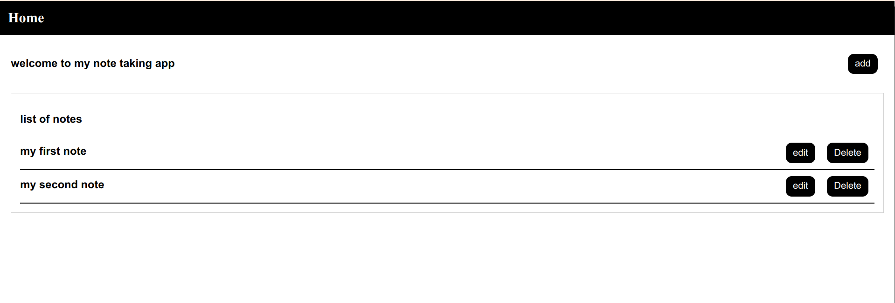

#                               Note Taking App


Table of contents:
-About The Project
-built with
-Installation
-Usage

# About the Project


 With this note taking app. You can add, edit, delete and see the content of your notes as much as you like. and they are kept in localestorage so if you refresh or exit your browser they will stay safe in your device. and its a secure app having been tested and all forms validated.

 ## Built with
 - reactJs
 - next.Js
 - jest
 
 ## installation
 1. Clone the repo here:
 ```
 git clone https://github.com/omar-wafaii/noteApp
 ```
 2. Install NPM packages
 ```
 npm install
 ```

 ## demo
 

 As you can see the home page list the saved note in the localestorage and for each note you can choose to edit or delete and you can add a note by clicking on the add button which will take you to the add page.

  
  As you can see by filling the form and clicking save the note will be saved for the user.

   
  when the user clicks edit on a note the he can change the content of the note without changing the id of the note.

  
  when the user clicks on a note it takes him on the list page which shows the content of the note.

   
  when the user wants to delete a note by clicking on the delete button on the homepage. a modal appears confirming if the user is sure to delete the note and if he clicks no nothing will happen and the modal disappears but if he clicks yes the note will be deleted from localestorage.
